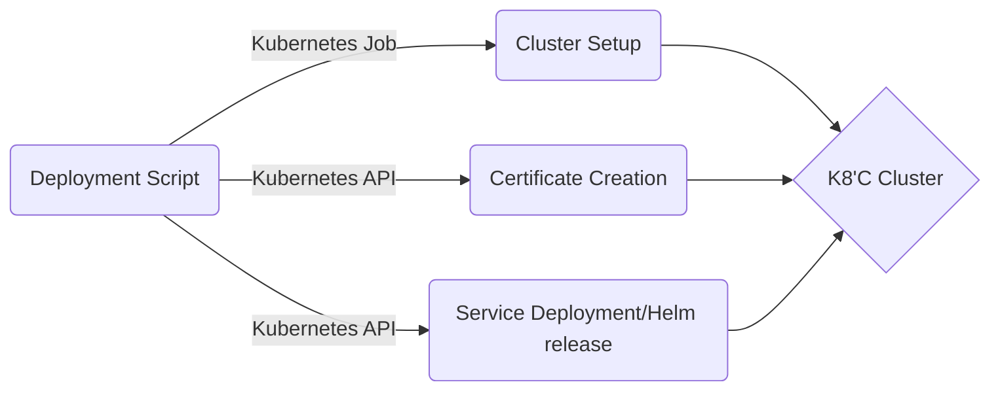
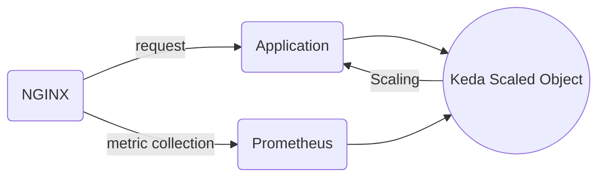

# Documentation Assignment

# Flow Diagram

## Requirements
- Kube config file
	- `KUBECONFIG` - Path of kube config file.
- Variables
	- `INSTALLATION_NAMESPACE` - Namespace for running job within cluster to setup with **Keda**, **Nginx**,  **Cert Manager** and **Prometheus**.
	- `DOMAIN` - Domain name for the deployment to be hosted upon.
	- `EMAIL` - Email address for cert-manager notifications.
	- `DEPLOYMENT_NAMESPACE` - Namespace for deployment of the services.
	- `DEPLOYMENT_NAME` - Name of the deployment.

> **FILE** deployment.sh (Starting Point)

## Dependencies installation
The script install three tools within the cluster
	- `Nginx` - Ingress controllers works as reverse proxy for the setup.
	- `Keda` - Event driven auto-scaler.
	- `Cert Manager` - Management of SSL certificates for https. 
	- `Prometheus` - Metric collector for k8's.
The installation of the tools are done within the cluster, by having the script in configmap mounted to job.

### Config Map
This contains four sections **keda.values.yaml**, **nginx.values.yaml**, **cert-manager.values.yaml** and **install.sh**
- `keda.values.yaml` - Keda helm release values.
- `nginx.values.yaml` - Nginx helm release values.
- `kube-prom-stack.values.yaml` - Prometheus helm release values.
- `cert-manager.values.yaml` - Cert Manager helm release values.
- `install.sh` - Script to make helm release to setup the cluster.

> **FILE**  setup/configmap.yaml.

## Certificate 
For the assignment i am using [`letsencrypt`](https://letsencrypt.org/) as the certificate authority and `http` challenge to create a `http certificate`.
> **FILE**  setup/certificate.yaml.

## Service Deployment
Service deployment is done via a custom helm chart which has following things templates, sample values can be referred from 
> **FILE** custom-chart/values.yaml
- **deployment.yaml** - This contains the template for k8's deployment.
-  **hpa.yaml** - This contains the template for k8's Horizontal pod autoscaler.
- **ingress.yaml** - This contains the template for k8's ingress.
- **service.yaml** - This contains the template for k8's service.
- **serviceaccount.yaml** - This contains the template for k8's Service Account.

## Keda Config
For this assignment purpose, i have implemented RBS (Rate base scaling), using **nginx**, **prometheus** and **keda**. 

## Completions
- [x] Connect to Cluster 
	- [x] Connect a kubectl client to the provided cluster.
	- [x] Install necessary tools within the cluster.
	- [x] Verify the installation of tools and provide a summary of the cluster setup.
- [x] Install KEDA
	- [x] Use Helm to install KEDA on the Kubernetes cluster
	- [x] Verify the installation and ensure that the KEDA operator is running.
- [x] Create Deployment:
	- [x] Public Image
	- [x] Resource Config
	- [x] Service Port
	- [x] Autoscaling on CPU and Memory
	- [x] Event source configuration for any metrics of KEDA
- [x] Create namespaced resources
	- [x] Deployment
	- [x] Service
	- [x] HPA, Keda
	- [x] Return deployment details
		- [x] Endpoint
		- [x] Scaling Config
- [x] Health Status Retrieval
	- [x] Pod Status
	- [x] CPU and memory usage.
	- [x] Report failures on deployment.
>For reporting failure something needs to run on cron and have alertmanager and alert channel for the same, this will require a configurations and tools which might take some time to configure so for the sake of simplicity i am running k8's apis in **watch mode**.